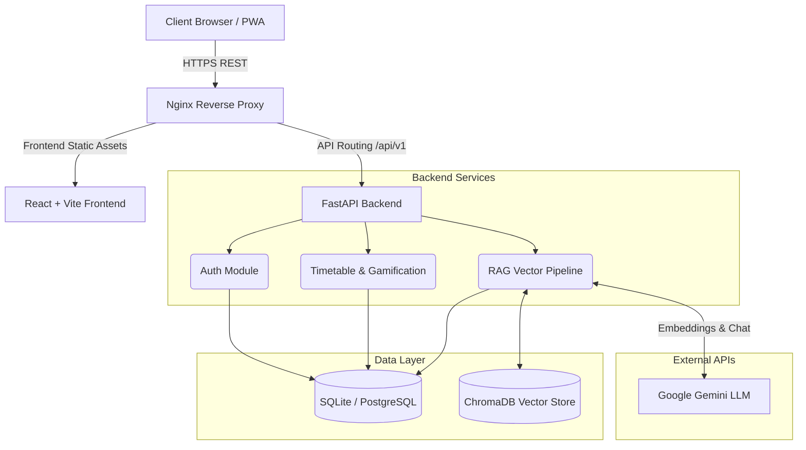

# System Architecture

The Smart Study Planner follows a standard, decoupled modern web application architecture: a React Single Page Application (SPA) communicating via RESTful JSON APIs to a FastAPI asynchronous backend. 

## High-Level Architecture Diagram

## Component Breakdown

1. **Frontend**: React 18 using Vite. State is managed via `Zustand` and `React Context`. UI components are styled using Tailwind CSS and `shadcn/ui` primitives.
2. **Backend**: Python 3.11 with FastAPI. Uses `SQLAlchemy 2.0` (async) for ORM mapping to the relational database.
3. **Data Persistence**: Uses a relational DB for structured data (Users, Timetables, Progress Logs).
4. **AI & Vector Storage**: Uploaded documents are parsed via `PyPDF2`, chunked, embedded using Google's `models/embedding-001`, and stored locally via `ChromaDB`.

## Security
- JWT (JSON Web Tokens) are used for stateless authentication.
- Passwords are encrypted using `bcrypt`.
- The `user_id` is used as a strict tenant filter across all DB queries and ChromaDB queries to ensure absolute data isolation.
