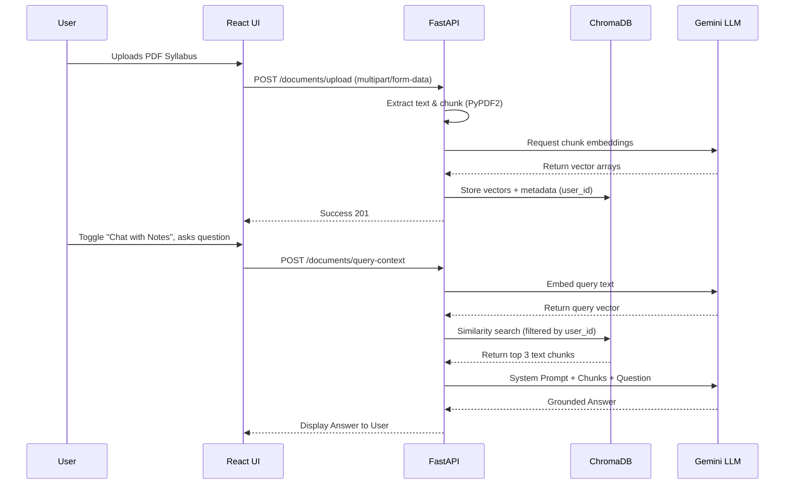
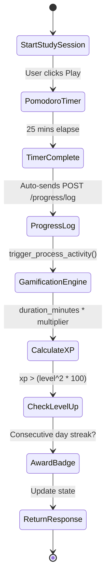

# System Flowcharts

## 1. RAG (Retrieval-Augmented Generation) Document Flow

```mermaid
sequenceDiagram
    participant User
    participant React UI
    participant FastAPI
    participant ChromaDB
    participant Gemini LLM

    User->>React UI: Uploads PDF Syllabus
    React UI->>FastAPI: POST /documents/upload (multipart/form-data)
    FastAPI->>FastAPI: Extract text & chunk (PyPDF2)
    FastAPI->>Gemini LLM: Request chunk embeddings
    Gemini LLM-->>FastAPI: Return vector arrays
    FastAPI->>ChromaDB: Store vectors + metadata (user_id)
    FastAPI-->>React UI: Success 201

    User->>React UI: Toggle "Chat with Notes", asks question
    React UI->>FastAPI: POST /documents/query-context
    FastAPI->>Gemini LLM: Embed query text
    Gemini LLM-->>FastAPI: Return query vector
    FastAPI->>ChromaDB: Similarity search (filtered by user_id)
    ChromaDB-->>FastAPI: Return top 3 text chunks
    FastAPI->>Gemini LLM: System Prompt + Chunks + Question
    Gemini LLM-->>FastAPI: Grounded Answer
    FastAPI-->>React UI: Display Answer to User
```

## 2. Gamification Loop

```mermaid
stateDiagram-v2
    [*] --> StartStudySession
    StartStudySession --> PomodoroTimer: User clicks Play
    PomodoroTimer --> TimerComplete: 25 mins elapse
    TimerComplete --> ProgressLog: Auto-sends POST /progress/log
    ProgressLog --> GamificationEngine: trigger_process_activity()
    GamificationEngine --> CalculateXP: duration_minutes * multiplier
    CalculateXP --> CheckLevelUp: xp > (level^2 * 100)
    CheckLevelUp --> AwardBadge: Consecutive day streak?
    AwardBadge --> ReturnResponse: Update state
    ReturnResponse --> [*]
```
