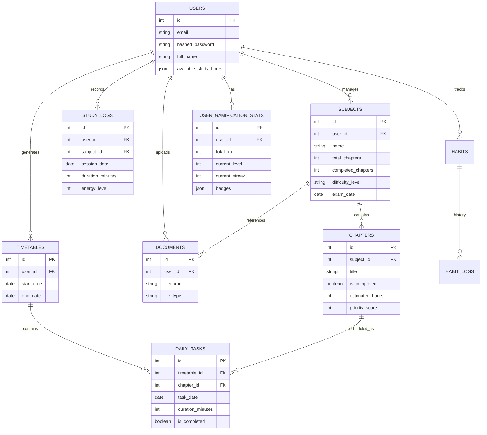

# Smart Study Planner ER Diagram

```mermaid
erDiagram
    USERS ||--o{ SUBJECTS : manages
    USERS ||--o{ TIMETABLES : generates
    USERS ||--o{ STUDY_LOGS : records
    USERS ||--o{ DOCUMENTS : uploads
    USERS ||--o{ HABITS : tracks
    USERS ||--o| USER_GAMIFICATION_STATS : has

    SUBJECTS ||--o{ CHAPTERS : contains
    SUBJECTS ||--o{ DOCUMENTS : references

    TIMETABLES ||--o{ DAILY_TASKS : contains
    CHAPTERS ||--o{ DAILY_TASKS : scheduled_as

    HABITS ||--o{ HABIT_LOGS : history

    USERS {
        int id PK
        string email
        string hashed_password
        string full_name
        json available_study_hours
    }

    SUBJECTS {
        int id PK
        int user_id FK
        string name
        int total_chapters
        int completed_chapters
        string difficulty_level
        date exam_date
    }

    CHAPTERS {
        int id PK
        int subject_id FK
        string title
        boolean is_completed
        int estimated_hours
        int priority_score
    }

    TIMETABLES {
        int id PK
        int user_id FK
        date start_date
        date end_date
    }

    DAILY_TASKS {
        int id PK
        int timetable_id FK
        int chapter_id FK
        date task_date
        int duration_minutes
        boolean is_completed
    }

    STUDY_LOGS {
        int id PK
        int user_id FK
        int subject_id FK
        date session_date
        int duration_minutes
        int energy_level
    }

    DOCUMENTS {
        int id PK
        int user_id FK
        string filename
        string file_type
    }

    USER_GAMIFICATION_STATS {
        int id PK
        int user_id FK
        int total_xp
        int current_level
        int current_streak
        json badges
    }
```
